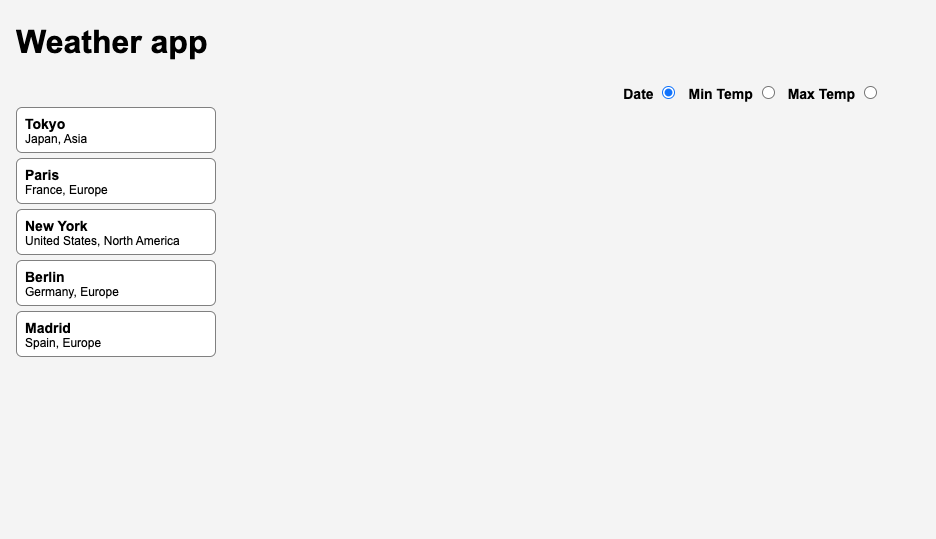

<h1>Context</h1>

In this task you will need to implement the missing parts of our Weather app. 
The app is written in JavaScript, React.js, and CSS.

The app gets 5 days forecast data for several specified cities and displays it on the right to the cities list, with a weather card dedicated to each forecast day. 
The forecast data is sorted by default by date and should be display from left - the earliest day -  to right - later dates (see design).

There are no actual real HTTP requests being made. All the cities and forecast data is being mocked (located in the <strong>mocks</strong>/api folder).

<h1>Task</h1>

You will need to implement all the missing features, mainly getting the forecast data and display it using the weather card.

There are a couple of <code>TODO</code> comments in the app files with instructions what to implement. 
<strong>Only change code where you're being instructed to do so.</strong>

There are the core features to implement, but there are also bonus features. 
If you still have time left, do the bonus tasks as much as you can.

<h3>Tips</h3><ul>
<li>
There are hint comments in the files, they should help you with finding the right solutions.

</li>
<li>
Consider comment your changes in order to give more context about the solutions where needed.

</li>
</ul>

<h1>Guidance</h1>
<h3>Folder structure</h3><ul>
<li><code>/src</code><ul>
<li>all the code related to the app and UI</li>
</ul>
</li>
<li><code>src/app.jsx</code> <ul>
<li>the main React component parent</li>
<li>all the main functionality is happening here. </li>
</ul>
</li>
<li><code>src/components</code><ul>
<li>all the sub components go here.</li>
</ul>
</li>
<li><code>src/components/WeatherCard</code><ul>
<li>the wather card that needs to be implemented.</li>
</ul>
</li>
<li><code>src/utils.js</code><ul>
<li>small utility functions and helpers to deal with data and other stuff.</li>
</ul>
</li>
<li><code>src/api.js</code><ul>
<li>everything that deals with making API requests and getting the data from somewhere</li>
<li>normally making real HTTP requests, but in this app it's just getting the mocked data.</li>
</ul>
</li>
<li><code>__mocks__</code><ul>
<li>mocked data is located here</li>
<li>should not be touched, it's read-only</li>
</ul>
</li>
<li><code>__tests__</code><ul>
<li>the location of our tests. </li>
<li>should not be touched, it's read-only</li>
</ul>
</li>
</ul>
<h3>Features to implement:</h3><ul>
<li>handleCitySelect --&gt; <code>src/App.jsx</code></li>
<li>getCityForecast --&gt; <code>src/App.jsx</code></li>
<li>Map over fiveDayForecast array to display the weather card for each day --&gt; <code>src/App/jsx</code> </li>
<li>WeatherCard --&gt; <code>src/components/WeatherCard.js</code></li>
<li>WeatherCard design --&gt; <code>src/components/style.css</code></li>
</ul>
<h4>Bonus (only do it if you have time left)</h4><ul>
<li>Error handling for city doesn't exist<ul>
<li>fetchCityForecast --&gt; <code>src/api.js</code></li>
<li>Display error text: "This city is not available" --&gt; <code>src/App.jsx</code> (no <code>TODO</code> comment, you will need to find where to place the changes)</li>
</ul>
</li>
<li>Sorting weather cards by: date (already by default), min and max temperatures.<ul>
<li>In <code>src/App.jsx</code> - react to the sort UI changes that in the radio buttons options (already exists).</li>
<li>You will need to implement a sorting function that reacts to changes in the sortParam.</li>
</ul>
</li>
</ul>

<strong>When you choose to click on the submit button, make sure you didn't miss anything.</strong>

You can't go back to the task and continue to work on it after submitting the solution. So be careful.

<h2>Design of app states</h2><h3>No city has been selected</h3>
<zoomable-image zoom-disabled="expandable &amp;&amp; !expanded" class="enabled" style="height: 123.809px;"><!----> <button class="btn-default btn-sm icon-expand" ng-click="$ctrl.expandOrContract($event)" tooltip="Make this image as large as possible" type="button"></button> <button class="btn-default btn-sm icon-minus" ng-click="$ctrl.zoomOut($event)" ng-disabled="$ctrl.zoomOutDisabled" tooltip="Zoom Out" type="button" disabled="disabled"></button> <button class="btn-default btn-sm" ng-class="{ active: $ctrl.is100 }" ng-click="$ctrl.zoom100($event)" tooltip="Zoom 1:1 pixels" type="button"> 1:1 </button> <button class="btn-default btn-sm icon-plus" ng-click="$ctrl.zoomIn($event)" ng-disabled="$ctrl.zoomInDisabled" tooltip="Zoom In" type="button"></button> <!----> 

</zoomable-image>

<h3>A city has been selected</h3>
<zoomable-image zoom-disabled="expandable &amp;&amp; !expanded" class="enabled" style="height: 115.388px;"><!----> <button class="btn-default btn-sm icon-expand" ng-click="$ctrl.expandOrContract($event)" tooltip="Make this image as large as possible" type="button"></button> <button class="btn-default btn-sm icon-minus" ng-click="$ctrl.zoomOut($event)" ng-disabled="$ctrl.zoomOutDisabled" tooltip="Zoom Out" type="button" disabled="disabled"></button> <button class="btn-default btn-sm" ng-class="{ active: $ctrl.is100 }" ng-click="$ctrl.zoom100($event)" tooltip="Zoom 1:1 pixels" type="button"> 1:1 </button> <button class="btn-default btn-sm icon-plus" ng-click="$ctrl.zoomIn($event)" ng-disabled="$ctrl.zoomInDisabled" tooltip="Zoom In" type="button"></button> <!----> 

</zoomable-image>

<h3>The selected city forecast does not exist or there was an error getting the city forecast.</h3>
<zoomable-image zoom-disabled="expandable &amp;&amp; !expanded" class="enabled" style="height: 96.837px;"><!----> <button class="btn-default btn-sm icon-expand" ng-click="$ctrl.expandOrContract($event)" tooltip="Make this image as large as possible" type="button"></button> <button class="btn-default btn-sm icon-minus" ng-click="$ctrl.zoomOut($event)" ng-disabled="$ctrl.zoomOutDisabled" tooltip="Zoom Out" type="button" disabled="disabled"></button> <button class="btn-default btn-sm" ng-class="{ active: $ctrl.is100 }" ng-click="$ctrl.zoom100($event)" tooltip="Zoom 1:1 pixels" type="button"> 1:1 </button> <button class="btn-default btn-sm icon-plus" ng-click="$ctrl.zoomIn($event)" ng-disabled="$ctrl.zoomInDisabled" tooltip="Zoom In" type="button"></button> <!----> 

</zoomable-image>

